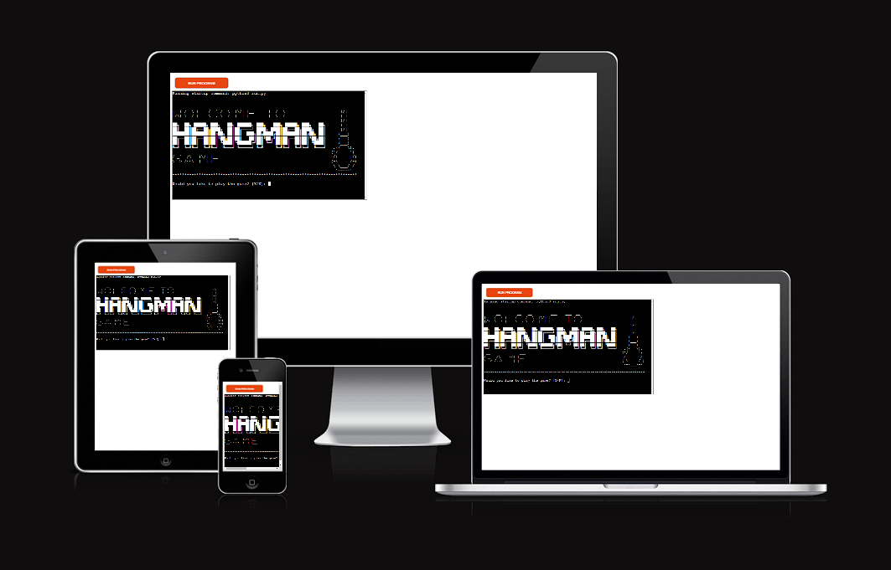
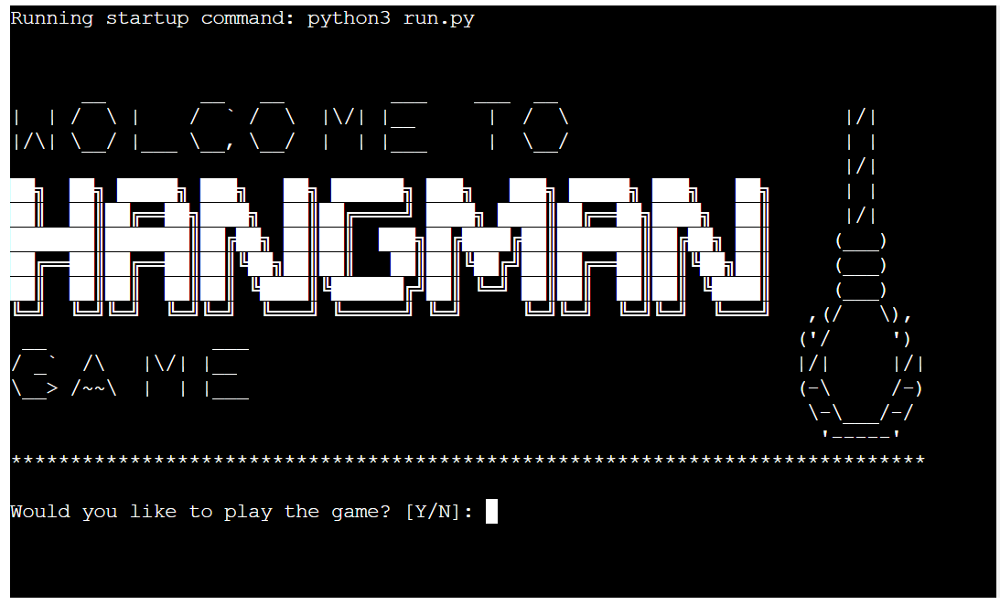
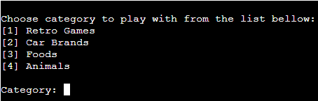
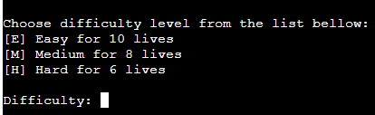
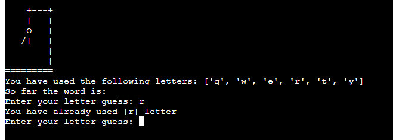
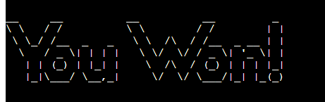
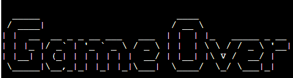
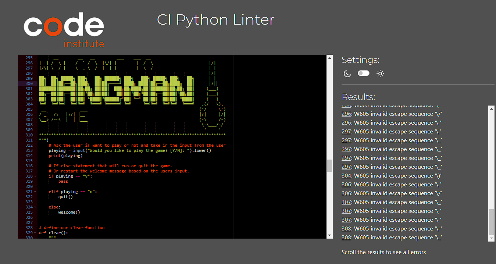

<h1>PYTHON HANGMAN GAME | PORTFOLIO PROJECT 3</h1>

This Python Terminal Hangman Game is the third project for code institute. 

<a href="https://python-hangman-game-ernestas.herokuapp.com/" target="_blank">View live website here.</a>

<h2>Table of Contents</h2>

- [User Experience (UX)](#ux)
    - [User stories](#user-stories)
    - [Features](#features)
- [Technologies](#technologies)
- [Testing](#testing)
- [Bugs](#bugs)
- [Deployment](#deployment)
- [Credits](#credits)
- [Acknowledgements](#acknowledgements)
   
   
<h2 id="ux">User Experience (UX)</h2>

<h3 id="user-stories">User Stories</h3>
<ul>
    <li>As a user, I want to be able to easily comprehend on what the game is.</li>
    <li>As a user, I want to be able to pick a category.</li>
    <li>As a user, I want to be able to pick a difficulty level.</li>
    <li>As a user, I want to be able to see what letters I have used so far.</li>
    <li>As a user, I want to see some interaction in the game.</li>
</ul>

<h3 id="features">Features</h3>

>As a user, I want to be able to easily comprehend on what the game is.
<ul>
    <li>The user is welcomed to play the hangman game as soon as the software launches.</li>
    
</ul> 

>As a user, I want to be able to pick a category.

<ul>
    <li>The user is given a choice between four categories to play with.</li>
    
</ul> 

>As a user, I want to be able to pick a difficulty level.

<ul>
    <li>The user is given a choice between three categories to play with.</li>
    
</ul> 

>As a user, I want to be able to see what letters I have used so far.
<ul>
    <li>When a letter is entered, it is displayed out on the list as "used letter" and the user is alerted if they input the same letter again.</li>
    
</ul> 

>As a user, I want to see some interaction in the game.
<ul>
    <li>The users are alerted if they input the same letter again.</li>
    <li>When users don't correctly guess a letter, the game will show various phases of the hangman picture.</li>
    <li>The user will be alerted if they won or lost the game at the end of the game.</li>
      
    
</ul> 

<h2 id="technologies">Technologies</h2>

<ul>
    <li>Python was the main language for this project.</li>
    <li>Text to ASCII Art Generator.</li>
    <li>Gitpod workspace to create the project.</li>
    <li>GitHub to store the project online.</li>
    <li>Heroku to host python project live.</li>
    <li>Code Institute Template to start the project</li>
    <li>CI Python Linter to test the code</li>
</ul>

<h2 id="testing">Testing</h2>

<h3>Manual Testing</h3>

I carefully tested the game to make sure everything is functional. including the main page, the categories, the levels of difficulty, the game itself, and the ending after a win or loss.

<h3>Validator</h3>

I ran the code via CI Python Linter to ensure there were no issues. With the exception of the text areas where I utilized ASCII graphics, the code was error-free.
I didn't change anything because the game was still able to run without any problems.iculty, the game itself, and the ending after a win or loss.

<h2 id="bugs">Bugs</h2>

<ul>
    <li>When you add more than one letter at a time, the computer recognizes it as a valid guess and updates the hangman game state.</li>
    <li>The hangman game state is updated when a number or any other sign is added and the software accepts it as a valid guess.</li>
    <li>When the game generated a random word that was more than one word, empty spaces were replaced with underscores, thus I opted to delete these words from the list because I couldn't fix the problem.</li>
</ul>

<h2 id="deployment">Deployment</h2>

<h3>Heroku</h3>
<ol>
    <li>Login to Heroku account.</li>
    <li>Click CREATE NEW APP button</li>
    <li>Enter app name, select region and click CREATE APP.</li>
    <li>Click SETTINGS button.</li>
    <li>Add Python and node.js buildpacks.</li>
    <li>Click DEPLOY button.</li>
    <li>Click CONNECT TO GITHUB button.</li>
    <li>Select repository and click CONNECT button.</li>
    <li>Select repository.</li>
    <li>Click DEPLOY BRANCH on manual deploy.</li>
</ol>

<h2 id="credits">Credits</h2>

<ul>
    <li><a href="https://www.youtube.com/watch?v=wmSysRui0cI&t=1313s" target="_blank">YOUTUBE TUTORIAL</a> On how to create hangman game.</li>
    <li><a href="https://www.geeksforgeeks.org/clear-screen-python/" target="_blank">geeksforgeeks.com</a> On how to clare the terminal</li>
    <li><a href="https://codeinstitute.net/ie/" target="_blank">CODE Institute</a> For the course material.</li>
</ul>

<h2 id="acknowledgements">Acknowledgements</h2>

<ul>
    <li>My Mentor Ronan for information and motivation.</li>
    <li>My Cohort lead Kasia for support.</li>
</ul>

This project was the first project so far that I really struggled with. From the confusing course material to poor selection of walk trough project. I tried to gain more knowledge from other sources but was to late due to the deadline and a limited amount of time that I had to finish the project.
